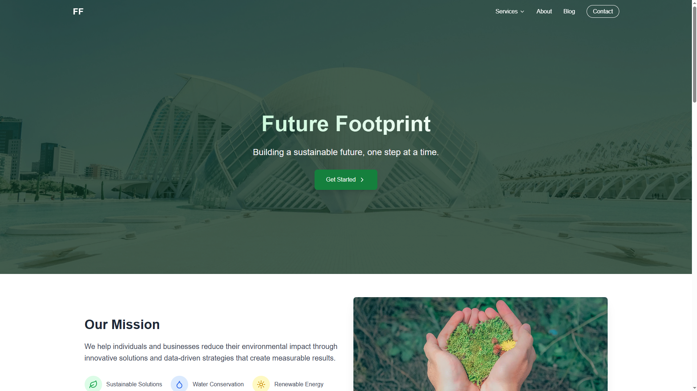
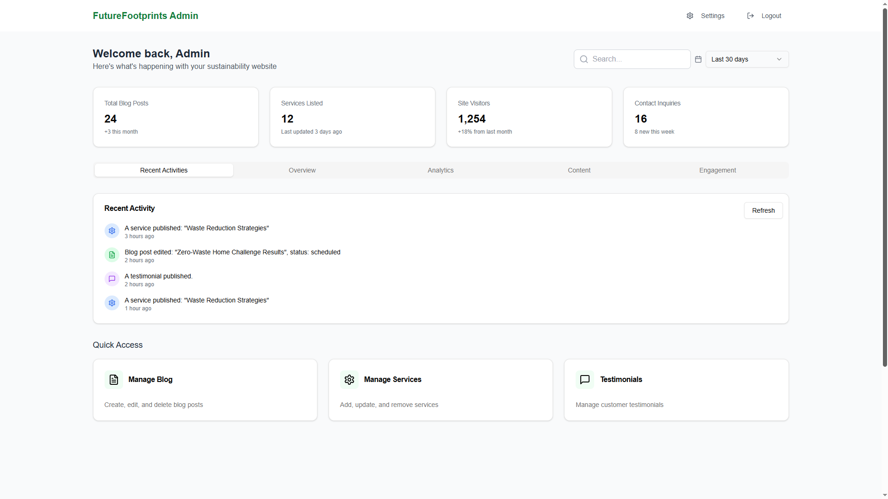
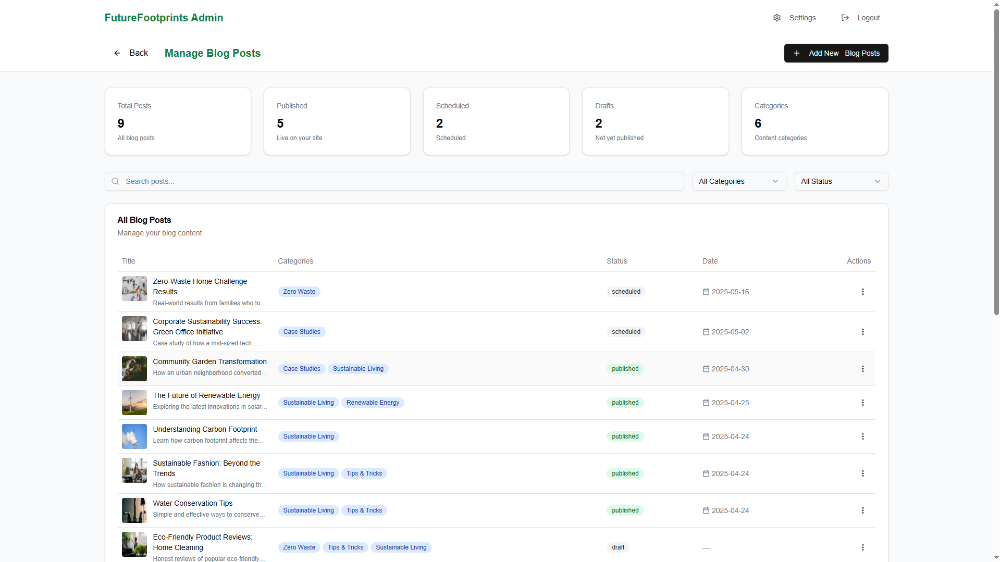
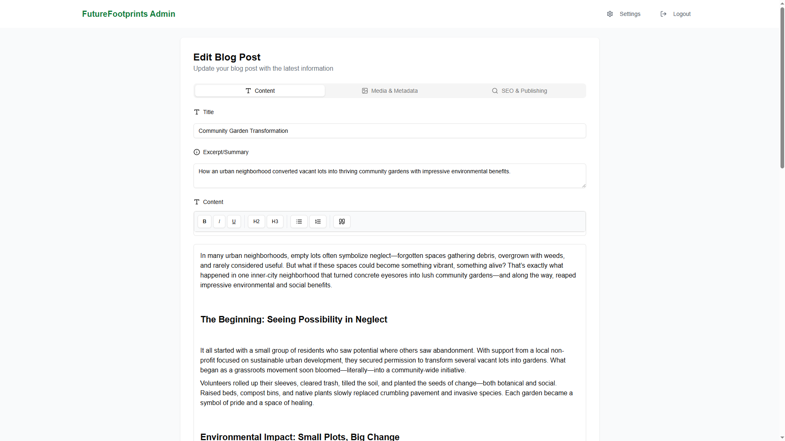

# Sustainable Company Website 🌱

This is a fully responsive web application built for a sustainability-focused company, featuring both a modern client-facing website and a powerful admin dashboard.
The client site showcases services, blog content, and a contact form to engage visitors, while the admin panel allows authenticated users to manage content such as blog posts, services, testimonials, and more — all through a clean and intuitive interface.
The project is optimized for performance, responsiveness, and scalability using modern web technologies like Next.js, TypeScript, and Tailwind CSS.

 [✨ Live Demo](https://sustainabilitycompany.vercel.app/) | [🔍 Features](#-features) | [🚀 Tech Stack](#-tech-stack) | [📁 Project Structure](#-project-structure) | [📸 Screenshots](#-screenshots)

## 🚀 Tech Stack

### 💻 Client Side
- [Next.js](https://nextjs.org/)
- [TypeScript](https://www.typescriptlang.org/)
- [Tailwind CSS](https://tailwindcss.com/)
- [Shadcn/UI](https://ui.shadcn.com/)
- [Framer Motion](https://www.framer.com/motion/)
- [Node.js](https://nodejs.org/)
- [MongoDB](https://www.mongodb.com/)
- [Zod](https://zod.dev/)
- [Lucide React](https://lucide.dev/)

### 🛠️ Admin Panel (WIP)
- [TypeScript](https://www.typescriptlang.org/)
- [Tailwind CSS](https://tailwindcss.com/)
- [Shadcn/UI](https://ui.shadcn.com/)
- [NextAuth.js](https://next-auth.js.org/)
- [Node.js](https://nodejs.org/)
- [MongoDB](https://www.mongodb.com/)
- [Cloudinary](https://cloudinary.com/)
- [Recharts](https://recharts.org/)
- [TipTap Editor](https://tiptap.dev/)

## ✨ Features

- Fully responsive design
- Smooth animations and transitions
- Static and dynamic pages: Contact, About, Services, Blog
- Authentication with NextAuth
- Admin panel to manage content
- Dynamic integration of blog and services

## 🔧 Upcoming Improvements

- Add SEO and accessibility enhancements
- Performance optimizations for faster loading

## 📁 Project Structure
├── app/
│   ├── (client)/                # Client-side pages and layouts
│   │   ├── about/               # About page
│   │   ├── blog/                # Blog list
│   │   │   └── [id]/            # Blog details
│   │   ├── services/            # Services list
│   │   │   └── [id]/            # Service details
│   │   ├── contact/             # Contact page
│   │   └── layout.tsx           # Main layout for client
│
│   ├── (admin)/                 # Admin panel pages and layout
│   │   ├── login/               # Admin login
│   │   ├── blog/                # Add/Edit/Delete blog
│   │   ├── services/            # Add/Edit/Delete services
│   │   ├── testimonials/        # Add/Edit/Delete testimonials
│   │   ├── settings/            # Site settings
│   │   └── layout.tsx           # Main layout for admin
│
├── api/                         # API routes
│   ├── auth/                    # Authentication handlers
│   ├── blog/                    # Blog API
│   ├── services/                # Services API
│   └── testimonial/             # Testimonials API
│   └── categories/              # Categories API
│   └── activities/              # Activities API
│
├── components/                  # Reusable UI components
│   ├── ui/                      # Shadcn/UI components
│   ├── client/                  # Client-specific components
│   └── admin/                   # Admin-specific components
│
├── lib/                         # Server-side logic, models, constants
│   ├── constants/               # App-wide constants
│   ├── types/                   # TypeScript types/interfaces
│   └── models/                  # MongoDB models
│
├── hooks/                       # Custom React hooks
│
├── public/                      # Static assets (images, icons, etc.)

## Screenshots 

### 🌍 Home Page

### 🔐 Admin Dashboard

### ✍️ Blog Editor

## 🤝 Contact

If you're interested in collaboration, hiring, or just want to connect:  
📩 Email: ozgevurmaz@gmail.com
🔗 LinkedIn: linkedin.com/in/elifozgevurmaz
